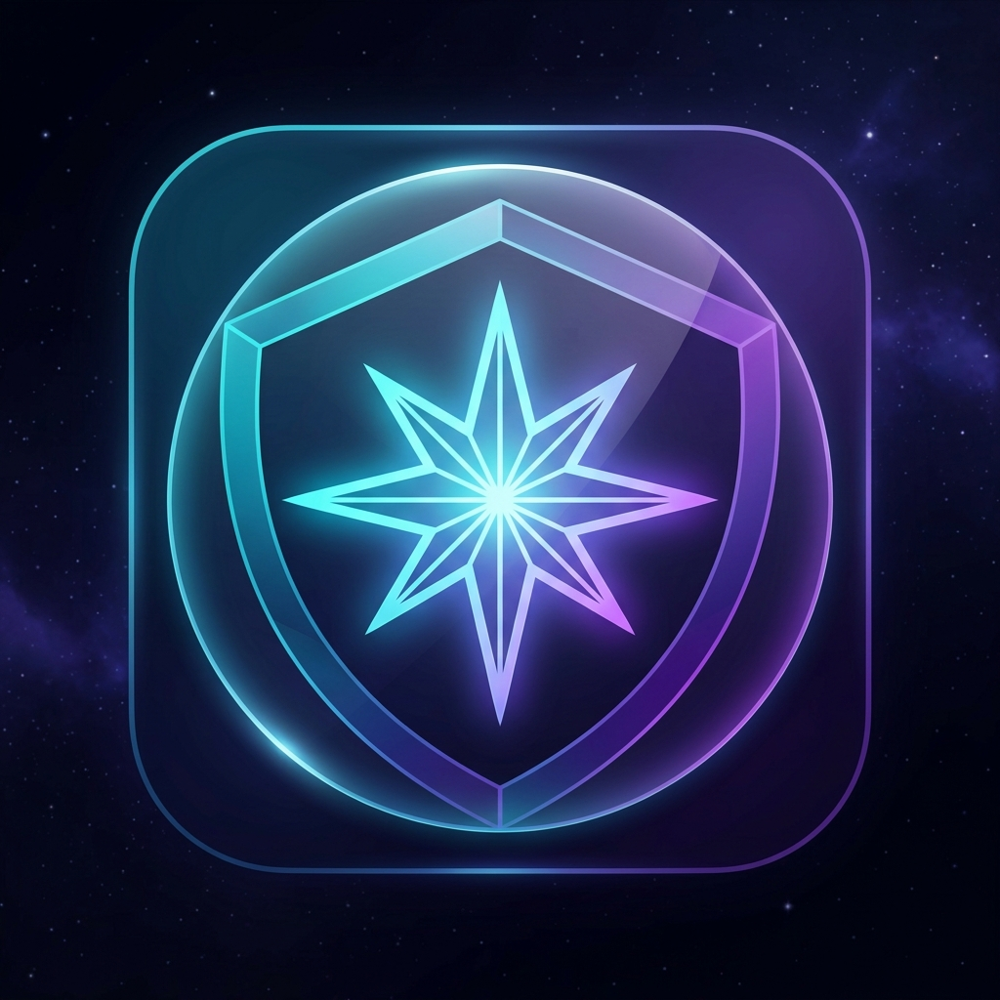

<h1 align="center">
    Astralstrap
</h1>

<p align="center">
    <strong>Astralstrap</strong> is an expanded, modernized, and privacy-conscious Roblox bootstrapper designed for peak performance, comprehensive alt account orchestration, dynamic cosmetic modding, and deep FastFlag customization.
</p>

<p align="center">
    
</p>

<div align="center">

[](./LICENSE)
[](https://github.com/huoadf/Astralstrap)
[](https://dotnet.microsoft.com/)
[](https://github.com/huoadf/Astralstrap)

</div>

---

## ✨ Features & Architecture

### 👥 Account Management & Alt Control
- **Alt Account Generator**: Instant throwaway credential generator with randomized gaming usernames, strong cryptographic passwords, 13+ birthdate presets, and 1-click token validator/importer.
- **Automated Multi-Instance Launcher**: Staggered, scheduled multi-client launcher across all saved accounts with customizable delay intervals and optional target Place ID / Job ID.
- **System Tray Account Switcher**: Switch between active DPAPI-encrypted Roblox accounts in 1 click directly from the Windows notification area.
- **Menu & Idle Rich Presence**: Displays *"In Roblox Menu" / "Browsing Experiences"* when Roblox is open before joining a game.

### ⚡ FastFlag Suite & 1-Click Bundles
- **1-Click Presets**:
  - **Competitive**: Strips grass, enables LOD level 9 low-poly geometry, enables FPS overlay.
  - **Max FPS**: Pauses voxelizer, strips grass, disables DPI scaling for maximum performance.
  - **Ultra Quality**: 4x MSAA, full foliage, maximum level 3 texture overrides.
- **Flag Diff Analyzer**: Compare active flags against saved or preset profiles with live conflict detection.
- **FPS & Frametime Graph Overlay**: Real-time HUD toggle for `FFlagDebugDisplayFPS`.

### 🎵 Audio & Cosmetic Modding
- **Custom Sound & Death Audio Manager**: 1-click previewer and installer for custom character reset sounds (Classic "OOF", Default, or custom `.ogg`/`.mp3`/`.wav` files).
- **Mod Texture & Asset Previewer**: In-app inspector to browse and preview image/texture assets inside any installed mod before launching.
- **Mod Collision Checker**: Detects overlapping file paths across mods and determines priority winners.

### 📊 Local Analytics & Matcha / MCP Sidecar
- **Play History & Session Analytics**: Aggregates total playtime, per-game history, session counts, and dates stored locally in `Data/PlayStats.json`.
- **Local Co-Player Tracker**: Encounters database stored strictly locally in `Data/CoPlayers.json` with zero external tracking.
- **Matcha / MCP Server**: Lightweight HTTP loopback JSON-RPC server listening on `http://127.0.0.1:37482/` with `/status`, `/playtime`, `/coplayers`, and `/mcp` endpoints for local AI assistants.

### 🎨 Visuals, Geometry & Diagnostics
- **Celestial Identity**: Modern 8-point astral star with neon cyan and cosmic violet glassmorphism.
- **Modern Animated Glow Splash**: Neon-cyan pulsing bootstrapper dialog.
- **Layout & Corner Geometry**: Customizable card spacing (Standard, Compact, Minimal) and corner rounding (Rounded, Modern Sharp, Pill).
- **Diagnostics & Crash Analyzer**: In-depth inspection of Roblox crash dumps (`.dmp`), engine logs, system environment, and 1-click diagnostic `.zip` export.

---

## 🛠️ Building From Source

### Prerequisites
- [.NET 9.0 SDK](https://dotnet.microsoft.com/download/dotnet/9.0)
- Windows 10 (Version 1809+) or Windows 11
- Visual Studio 2022 or VS Code with C# Dev Kit

### Compilation
```powershell
# Clone repository
git clone https://github.com/huoadf/Astralstrap.git
cd Astralstrap

# Build solution
dotnet build Bloxstrap/Bloxstrap.csproj -c Release
```

The output binary will be generated under `Bloxstrap/bin/Release/net9.0-windows/Astralstrap.exe`.

---

## 📜 Licensing

Astralstrap follows a multi-license model:
- Modifications authored by Astralstrap / Froststrap are licensed under the **[GNU AGPL-3.0](./LICENSE)**.
- Code inherited from upstream Fishstrap / Bloxstrap remains under the **[MIT License](https://opensource.org/licenses/MIT)**.
- Nix-specific components are in the public domain (**[Unlicense](https://unlicense.org/)**).
